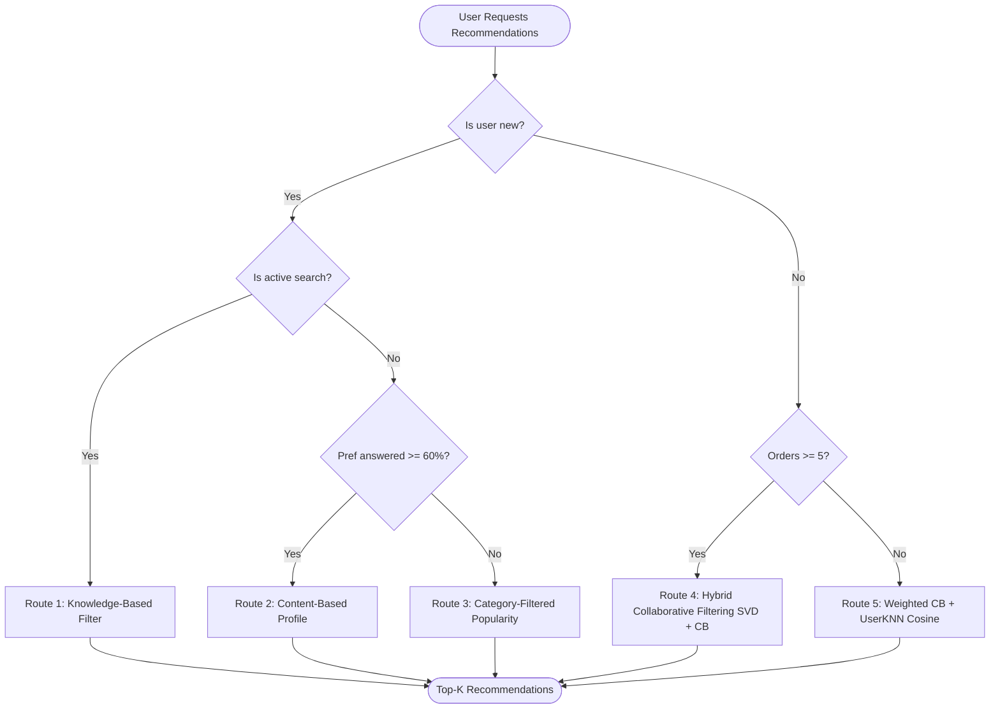
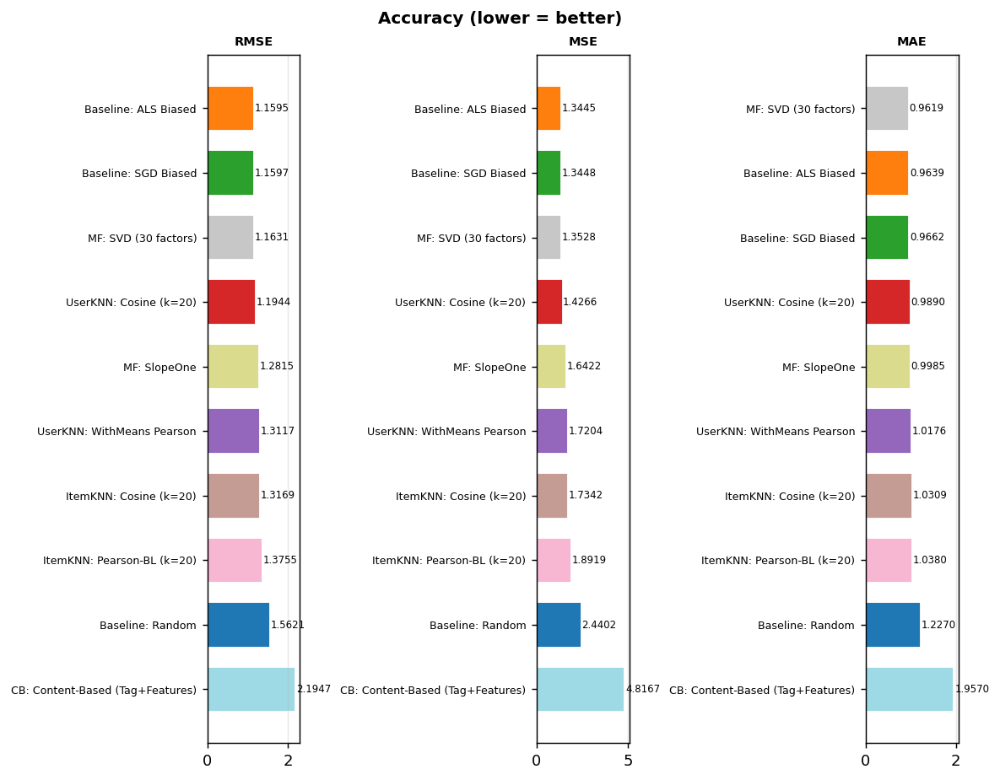
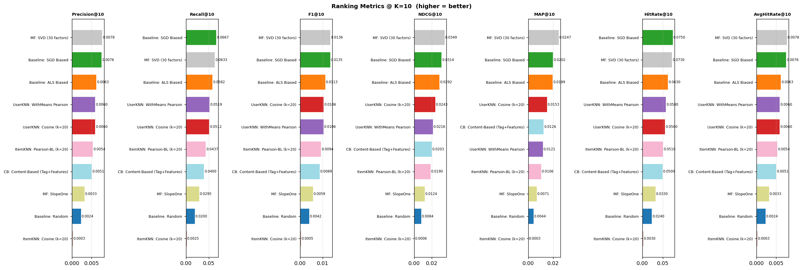
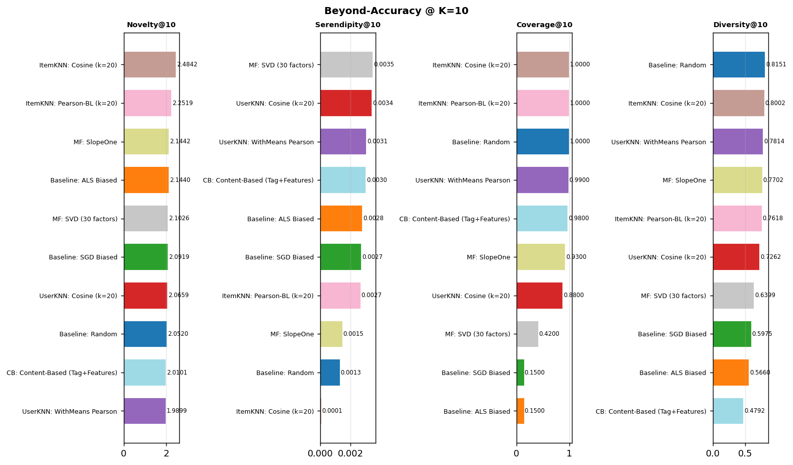

# Restaurant Recommendation System & Benchmarking Suite

## 🍽️ Project Overview
This repository contains a comprehensive, production-grade Restaurant Recommendation System designed to address both high-precision personalization for active users and the critical cold-start challenges common in food delivery marketplaces. The system integrates collaborative filtering (SVD, KNN), content-based similarity, knowledge-based filtering, and popularity baseline models into a dynamic multi-route routing architecture.

---

## 🏗️ System Architecture

### Multi-Route Routing Recommender
The core entry point of the recommendation engine is `recommender(user, search, k)`, which dynamically routes queries through five distinct pipelines depending on the user's profile, active search intent, and transaction history.



### Recommendation Engine Pseudocode
Here is the detailed software structure of the recommendation engine implementing the routing logic:

```python
# Pseudo-code structure for the Multi-Route Recommender Router

class RestaurantRecommenderSystem:
    def __init__(self):
        # Model instances (wrapped in unified prediction interfaces)
        self.svd_model = SVDModel()         # Matrix Factorization (Latent space)
        self.cb_model = ContentBasedModel() # Tag/Features Similarity profile
        self.knn_model = UserKNNModel()     # Collaborative User neighborhood
        self.db = DatabaseConnection()      # Context and Vendor databases

    def recommender(self, user: User, search: int, k: int = 5) -> List[Restaurant]:
        """
        Dynamically routes recommendation requests based on context constraints
        and user data availability.
        """
        # Hard context filtering: only open restaurants within active delivery distance
        candidates = self.db.get_open_restaurants_in_range(user.location)

        # ---------------------------------------------------------------------
        # CASE A: New User (Cold Start)
        # ---------------------------------------------------------------------
        if user.is_new:
            if search == 1:
                # Route 1: Active query tag filtering + Geographical proximity ranking
                return self.knowledge_based_rec(user, candidates, k)
                
            elif user.preferences_answered_percent >= 0.60:
                # Route 2: Onboarding preferences tag matching
                cb_recs = self.cb_model.score_and_rank(user.preference_profile, candidates, k)
                # Pad with high-diversity items (UserKNN) to foster discovery
                return self.inject_diversity_padding(cb_recs, candidates, k)
                
            else:
                # Route 3: Top-popularity fallback with cuisine capping
                popular_recs = self.get_globally_popular(candidates, limit=k * 2)
                return self.apply_category_cap(popular_recs, limit_per_cuisine=2, k=k)

        # ---------------------------------------------------------------------
        # CASE B: Existing User (Warm/Hot Start)
        # ---------------------------------------------------------------------
        else:
            if user.order_count >= 5:
                # Route 4: SVD (Accuracy) + Content-Based (Personal taste tags alignment)
                svd_scores = self.svd_model.predict_scores(user.id, candidates)
                cb_scores = self.cb_model.get_similarity_scores(user.id, candidates)
                
                # Hybrid Blend: 70% Collaborative Filtering + 30% Tag Affinity
                hybrid_scores = {}
                for restaurant in candidates:
                    hybrid_scores[restaurant] = (0.7 * svd_scores[restaurant]) + (0.3 * cb_scores[restaurant])
                
                sorted_recs = sorted(hybrid_scores, key=hybrid_scores.get, reverse=True)
                return self.diverse_rerank(sorted_recs, k)
                
            else:
                # Route 5: Weighted CB + UserKNN Cosine (SVD is unstable with <5 orders)
                cb_scores = self.cb_model.get_similarity_scores(user.id, candidates)
                knn_scores = self.knn_model.get_similarity_scores(user.id, candidates)
                
                # Hybrid Blend: 50% explicit preferences + 50% similar users behavior
                hybrid_scores = {}
                for restaurant in candidates:
                    hybrid_scores[restaurant] = (0.5 * cb_scores[restaurant]) + (0.5 * knn_scores[restaurant])
                
                sorted_recs = sorted(hybrid_scores, key=hybrid_scores.get, reverse=True)
                return self.diverse_rerank(sorted_recs, k)
```

---

## 📊 Benchmark Analysis & Model Selection

The recommendation engine's design was informed by our offline benchmarking suite, evaluated over **1,000 users**.

### Benchmark Results Summary

| Model Class | Model Name | RMSE | Precision@10 | Recall@10 | NDCG@10 | HitRate@10 | Coverage@10 | Diversity@10 |
| :--- | :--- | :---: | :---: | :---: | :---: | :---: | :---: | :---: |
| **Matrix Factorization** | `MF: SVD (30 factors)` | 1.1648 | **0.0072** | 0.0503 | 0.0263 | **0.0690** | 0.4100 | 0.6477 |
| **Content-Based** | `CB: Content-Based` | 2.1947 | 0.0057 | 0.0444 | **0.0227** | 0.0520 | 0.9600 | 0.4775 |
| **KNN (Neighborhood)** | `UserKNN: Cosine (k=20)` | 1.1944 | 0.0050 | **0.0514** | 0.0207 | 0.0580 | 0.9100 | 0.7261 |
| **KNN (Neighborhood)** | `ItemKNN: Cosine (k=20)` | 1.3169 | 0.0010 | 0.0085 | 0.0032 | 0.0100 | **1.0000** | 0.8019 |
| **Baselines** | `Baseline: ALS Biased` | **1.1595** | 0.0079 | 0.0672 | 0.0321 | 0.0760 | 0.1500 | 0.5658 |
| **Baselines** | `Baseline: Random` | 1.5621 | 0.0042 | 0.0305 | 0.0148 | 0.0410 | 1.0000 | **0.8118** |

### Benchmark Visualizations

Here are the metric curves plotted from the results directory:

#### 1. Rating Accuracy (lower is better)


#### 2. Top-K Ranking Metrics (higher is better)


#### 3. Beyond-Accuracy Marketplace Trade-offs


---

## 🛠️ Why We Selected Each Model For Our Architecture

Choosing the right model for each route requires balancing user satisfaction with catalog health:

### 1. Route 2 (Cold Start Preferences) $\rightarrow$ `CB: Content-Based`
* **Why:** In the benchmarks, the `Content-Based` model achieves a high **NDCG@10 (`0.0227`)** and **Coverage (`0.9600`)**. 
* **Business Value:** When a new user completes the onboarding questionnaire, we can immediately map their answers to a profile and surface high-coverage recommendations from 96% of the catalog, preventing empty states and cold-start bounces.
* **Mitigation:** CB has very low diversity (`0.4775`). We mitigate this in Route 2 by padding the list with recommendations from `UserKNN: Cosine` (which has a high **`0.7261` diversity score**).

### 2. Route 3 (Cold Start No Info) $\rightarrow$ `Baseline: ALS Biased` + Cuisine Capping
* **Why:** `ALS Biased` has the highest ranking metrics on anonymous metrics (Precision@10: `0.0079`, HitRate@10: `0.0760`), proving it is a strong baseline.
* **Business Value:** Outperforms other approaches when zero profile data is available.
* **Mitigation:** Its coverage is only `0.1500`, meaning it will recommend the exact same 15 restaurants to everyone. By applying a **category cap (maximum of 2 restaurants per cuisine)**, we force list variety and distribute orders to minor restaurants.

### 3. Route 4 (Active Users) $\rightarrow$ `MF: SVD`
* **Why:** `SVD (30 factors)` is the best collaborative filtering model for accuracy (RMSE `1.1648`) and precision/hits.
* **Business Value:** It scales efficiently and handles complex user-cuisine relationships.
* **Mitigation:** Pure SVD has a catalog coverage of only `0.4100`. In Route 4, we use a hybrid approach that blends SVD with Content-Based scores (0.7 SVD + 0.3 CB) to boost coverage and diversity.

### 4. Route 5 (Sparse Histories) $\rightarrow$ `UserKNN: Cosine (k=20)` + `CB: Content-Based`
* **Why:** Active collaborative filtering (SVD) requires dense ratings to generalize. For users with 1–4 orders, SVD overfits. 
* **Business Value:** `UserKNN: Cosine` has excellent coverage (`0.9100`) and high diversity (`0.7261`) to bridge this gap.
* **Implementation:** A 50/50 blend of CB (which respects their few orders) and UserKNN (which introduces tastes of similar eaters) creates a highly engaging intermediate experience.

---

## 📈 Recommendation Metrics Explained

To maintain a healthy marketplace, our suite evaluates recommendations across three primary dimensions:

### 1. Accuracy Metrics (Rating Prediction)
* **RMSE (Root Mean Squared Error) & MAE (Mean Absolute Error):** Measures the deviation between predicted scores and actual user ratings. Crucial for assessing regression stability.

### 2. Ranking Metrics (Top-K Relevancy)
* **Precision@K:** The proportion of recommended items in the top-K list that the user actually ordered from.
* **Recall@K:** The proportion of all the user's liked items that were successfully retrieved in the top-K list.
* **NDCG@K (Normalized Discounted Cumulative Gain):** Measures the quality of the ranking order, assigning higher rewards when the user's favorite restaurants appear at the top of the list.
* **HitRate@K:** The percentage of users who received at least one recommendation they ordered from in their top-K list.

### 3. Beyond-Accuracy Metrics (Catalog & User Experience Health)
* **Novelty@K:** Measures the information content of recommendations. High novelty indicates the model is surfacing lesser-known, local "hidden gems" rather than just popular national chains.
* **Diversity@K:** The average distance between the cuisine tags of the recommended items. High diversity ensures a balanced variety of food types in the feed.
* **Serendipity@K:** Measures the "pleasant surprise" factor by identifying recommendations that are both relevant and unexpected based on the user's historical profile.
* **Coverage@K:** The fraction of the total vendor catalog that gets recommended to at least one user. High coverage ensures fair exposure for all partners on the platform.

---

## 📁 Repository Structure

```
├── archive/                  # Raw Akeed dataset (orders.csv, vendors.csv, etc.)
├── results/                  # Generated CSVs and metric comparison charts
│   ├── benchmark_results.csv
│   ├── accuracy.png
│   ├── ranking.png
│   └── beyond.png
├── src/
│   ├── __init__.py
│   ├── data_loader.py       # Data cleaning, user filtering, and implicit rating builder
│   ├── models.py            # Unified RecommenderModel wrappers and catalogues
│   ├── metrics.py           # Custom implementation of accuracy, ranking, and beyond-accuracy metrics
│   └── benchmark.py         # Main parallel benchmarking evaluation logic
├── .cache/                   # Cached Parquet rating matrices (for instant reloading)
├── quick_benchmark.py        # Lightweight, standalone single-core benchmarking script
├── run_benchmark.py          # Multiprocess benchmarking script
└── README.md                 # Project documentation (this file)
```

---

## 🚀 Running the Benchmarks

To execute the benchmarking suite and generate results/charts:

### Full Multi-core Benchmark
Runs the evaluation across all CPU cores in parallel on 1,000 sampled users:
```bash
python run_benchmark.py
```

### Standalone Quick Benchmark
Runs a fast single-core simulation:
```bash
python quick_benchmark.py
```
